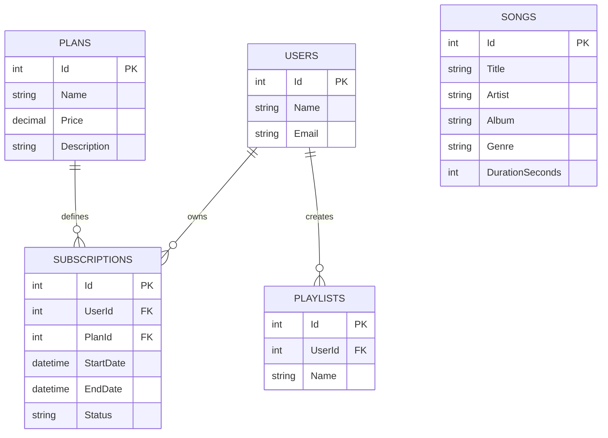
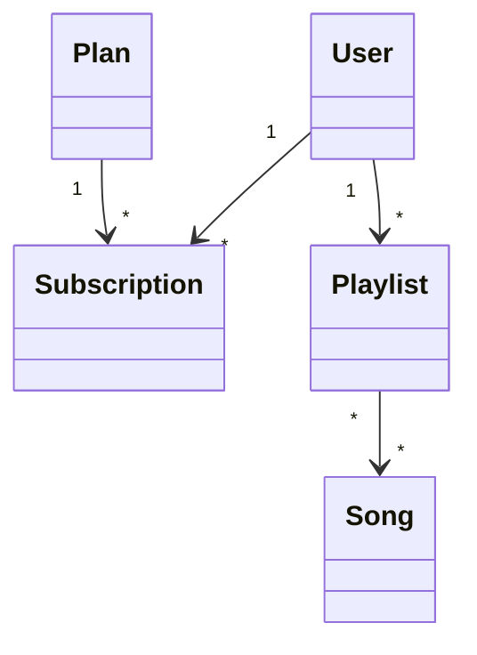
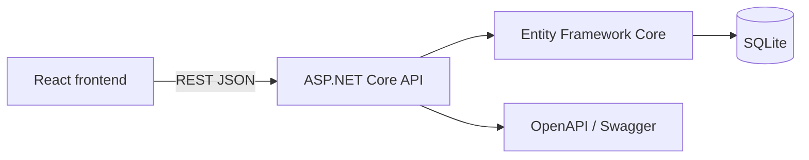
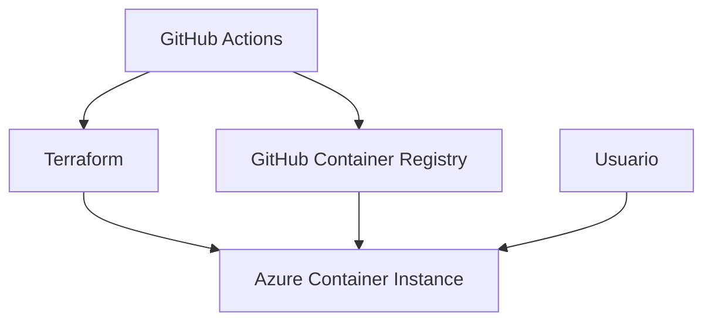

# Documentación técnica de Sonora

## Diccionario de datos

| Tabla | Campo | Tipo | Descripción |
|---|---|---|---|
| Users | Id | integer | Identificador del usuario |
| Users | Name / Email | text | Datos de contacto |
| Plans | Id, Name, Price | integer/text/decimal | Plan comercial y precio mensual |
| Songs | Id, Title, Artist, Album, Genre, DurationSeconds | integer/text | Catálogo musical |
| Subscriptions | Id, UserId, PlanId, StartDate, EndDate, Status | integer/datetime/text | Ciclo de vida de una suscripción |
| Playlists | Id, UserId, Name | integer/text | Playlist creada por un usuario |

## Diagrama entidad-relación

## Diagrama de clases

## Diagrama de componentes

## Diagrama de despliegue

## Generación

`generate-documentation.yml` publica este documento como artefacto en cada ejecución manual o cambio en `main`. La infraestructura se valida con Terraform y los análisis de Sonar, Snyk y Semgrep se ejecutan en workflows separados.
